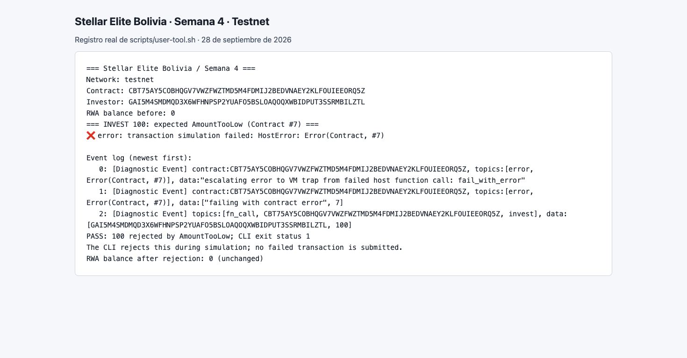
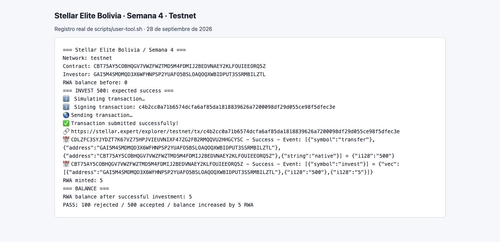
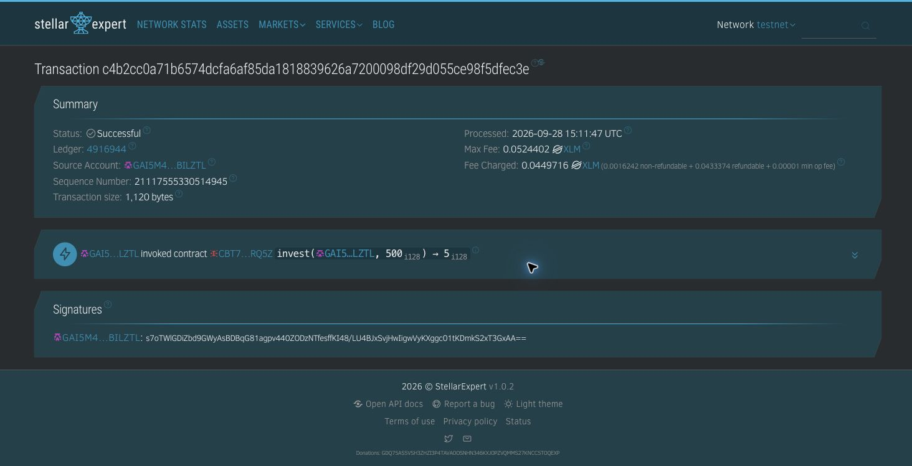

# Entregable semana 4 — Stellar Elite Bolivia

**Participante:** Daniel Cueto  
**Red:** Stellar Testnet  
**Fecha de la ejecución:** 28 de septiembre de 2026

## Enlaces para entregar

- **Fork:** https://github.com/danelerr/rwa-launchpad-bootcamp
- **Código y test:** [dia-3](https://github.com/danelerr/rwa-launchpad-bootcamp/tree/main/dia-3)
- **Contract ID:** `CBT75AY5COBHQGV7VWZFWZTMD5M4FDMIJ2BEDVNAEY2KLFOUIEEORQ5Z`
- **Contrato en Stellar Expert:** https://stellar.expert/explorer/testnet/contract/CBT75AY5COBHQGV7VWZFWZTMD5M4FDMIJ2BEDVNAEY2KLFOUIEEORQ5Z
- **Inversión exitosa:** https://stellar.expert/explorer/testnet/tx/c4b2cc0a71b6574dcfa6af85da1818839626a7200098df29d055ce98f5dfec3e

## Resultado verificado

| Paso | Resultado |
| --- | --- |
| Admin inicializa | Confirmado en Testnet |
| Admin agrega al inversor a whitelist | Confirmado en Testnet |
| Invertir 100 | Rechazado con `AmountTooLow`, código 7 |
| Balance después del rechazo | 0 RWA |
| Invertir 500 | Confirmado; emite 5 RWA a precio de 100 |
| Balance final del inversor | 5 RWA |
| Tests | 3 aprobados, 0 fallidos |

La inversión de 100 falla en la simulación contra el contrato desplegado y no
se transmite a la red. La de 500 tiene estado `SUCCESS` comprobado mediante
`getTransaction`; la respuesta RPC completa se conserva en
[evidence/transaction-rpc.json](evidence/transaction-rpc.json).

**Token de pago:** SAC nativo XLM de Testnet,
`CDLZFC3SYJYDZT7K67VZ75HPJVIEUVNIXF47ZG2FB2RMQQVU2HHGCYSC`.
Se usan las unidades mínimas enteras del ejercicio: 500 = 0.0000500 XLM de
Testnet. XLM de Testnet fue elegido para esta entrega. Ver [README](README.md)
para las unidades, comandos de reproducción y alcance del ejemplo.

## Capturas de evidencia

Estas capturas muestran los registros reales guardados por `user-tool.sh`,
renderizados en el navegador para facilitar su lectura. Los archivos `.log`
originales se incluyen junto con las imágenes. No se presentan como capturas
del frontend del launchpad.

### Inversión de 100 rechazada

### Inversión de 500 exitosa y balance final

### Confirmación en Stellar Expert

## Archivos de respaldo

- [Inicialización y whitelist](evidence/admin-setup.log)
- [Ejecución completa del usuario](evidence/user-demo.log)
- [Despliegue](evidence/deploy.log)
- [Identificadores y hash del WASM](evidence/receipt.json)
- [Test de la regla](src/test.rs)

Las claves de las dos cuentas de pruebas están guardadas localmente mediante
Stellar CLI y no forman parte del repositorio.
